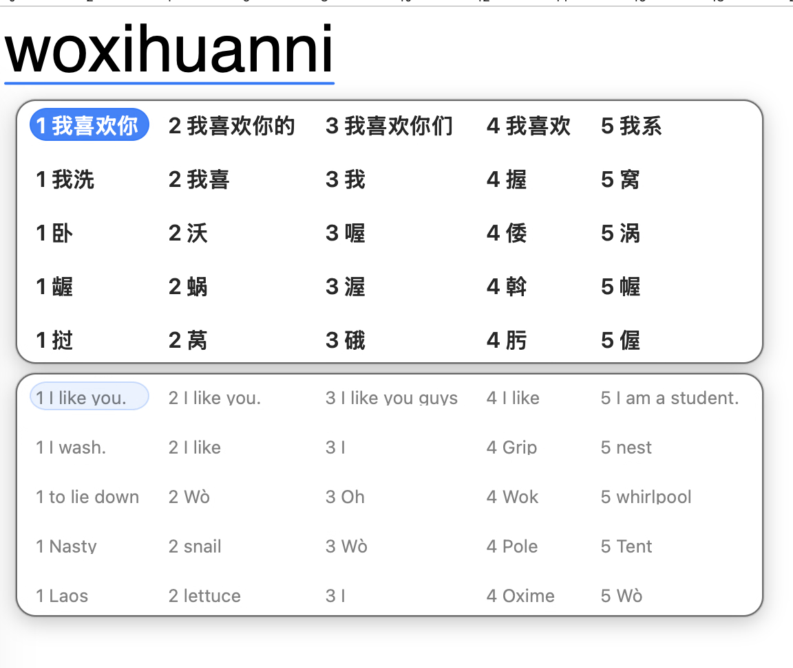

<div align="center">
  <br />
  
  <h1>BilineIME</h1>
  <p>
    <strong>A macOS Chinese input method for bilingual drafting.</strong>
  </p>
  <p>
    Type Chinese. Preview English. Commit the layer you mean.
  </p>
  <p>
    <a href="#development"></a>
    <a href="#architecture"></a>
    <a href="#current-capabilities"></a>
    <a href="LICENSE"></a>
  </p>
</div>

<table>
  <tr>
    <td align="center" width="33%">
      <strong>Chinese first</strong><br />
      Rime-backed candidates stay the source of truth.
    </td>
    <td align="center" width="33%">
      <strong>Live preview</strong><br />
      English suggestions update asynchronously while typing stays responsive.
    </td>
    <td align="center" width="33%">
      <strong>Layer commit</strong><br />
      Switch between Chinese and English output without leaving composition.
    </td>
  </tr>
</table>

<p align="center">
  <strong>Pre-release:</strong> BilineIME is under active stabilization. Core
  behavior and deployment come before feature expansion.
</p>

<br />

<table>
  <tr>
    <td align="center">
      <a href="docs/assets/readme-mode1-textedit.png">
        
      </a>
      <br />
      <sub>Real TextEdit smoke screenshot: Chinese candidates above English preview rows.</sub>
    </td>
  </tr>
</table>

## What It Does

BilineIME has one product model: **composition-time translation preview**.

You type Chinese pinyin in a normal macOS input method flow. Biline shows the
current Chinese candidates in a custom candidate panel and renders an English
preview for the same visible candidates. Chinese input remains the source of
truth: preview text never changes Chinese candidate ranking, paging, or
composition state.

The active commit layer can be switched between Chinese and English for the
selected candidate. Confirming a candidate commits only the active layer and
then clears the composition.

## Current Capabilities

- Native macOS InputMethodKit app with a custom AppKit bilingual candidate panel.
- Rime-backed Chinese candidate engine with separate simplified and traditional
  schemas.
- Candidate browsing by row and column, including compact and expanded panel
  presentation.
- `Shift+Tab` switches the active commit layer without changing the selected
  candidate.
- `=` / `]` browse downward or expand the candidate matrix during composition;
  `-` / `[` browse upward or collapse; `+` is literal input.
- Async translation preview with debounce, cache, request coalescing, stale
  result suppression, and failure isolation.
- Alibaba Cloud Machine Translation provider through user-managed credentials.
- Native Settings app for translation credentials, target language, character
  form, punctuation form, and candidate layout.
- Unified dev lifecycle through `bilinectl`, with Make targets kept as thin
  wrappers.

## Development

New machine setup and credential handoff live in
[`docs/development-handoff.md`](docs/development-handoff.md).

Common commands:

```bash
make bootstrap
make project
make test
make build-ime
make build-settings
make install-ime
make diagnose-ime
make repair-ime
make build-ime-release
make package-release
make verify
```

What matters most day to day:

- `make test` runs Swift Package tests.
- `make build-ime` builds the developer input method target.
- `make build-settings` builds the developer Settings app.
- `make install-ime` runs the level 1 dev lifecycle reinstall for both dev apps.
- `make diagnose-ime` prints the dev lifecycle snapshot.
- `make repair-ime` prints a dry-run repair plan unless `CONFIRM=1` is set.
- `make verify` runs package tests plus both IME build variants.

Build products are generated under `~/Library/Caches/BilineIME/DerivedData`
instead of the repo tree. `BilineIME.xcodeproj` is generated from `project.yml`
and should be regenerated locally, not committed.

## Manual Host Verification

IME behavior is not considered verified by tests or build success alone.

For any change that affects composition, punctuation, candidate browsing,
active layer, marked text, candidate panel rendering, install flow, or
host-facing IME behavior, use this sequence:

```bash
swift test --filter 'InputControllerEventRouterTests|BilingualInputSessionTests|BilineRimeTests'
make build-ime
make install-ime
```

Then stop and verify in a real host manually:

- The user selects `BilineIME Dev`.
- The user focuses TextEdit.
- The user types, browses candidates, switches layers, commits, and reports the
  result.
- Codex and project scripts must not switch input sources, focus TextEdit,
  inject keys, browse candidates, or commit text.

Candidate-panel screenshots must come from user-prepared host state. If the
panel may be on another display, capture or request screenshots across displays.

## Architecture

The current architecture is documented in
[`docs/architecture.md`](docs/architecture.md).

The short version:

- Keep InputMethodKit glue thin.
- Keep composition state in testable Swift Package modules.
- Keep Chinese candidate generation behind a `CandidateEngine` boundary.
- Keep English preview behind `PreviewCoordinator` and `TranslationProvider`.
- Treat bilingual preview as an add-on to Chinese IME behavior, never as the
  source of truth.

Operational rules and accepted decisions live in:

- [`AGENTS.md`](AGENTS.md)
- [`docs/standards/engineering.md`](docs/standards/engineering.md)
- [`docs/standards/acceptance.md`](docs/standards/acceptance.md)
- [`docs/adr/`](docs/adr/)

## Roadmap

BilineIME is undergoing high-frequency, intensive updates. Our immediate priority is **core stabilization and deployment**, ensuring the baseline bilingual typing experience is rock-solid before we announce or commit to new features.

Active stabilization efforts:

- Hardening Rime candidate quality and consumed-span behavior.
- Stabilizing simplified and traditional schemas with separate user dictionaries.
- Improving candidate panel layout resilience for long translations and multi-display anchoring.
- Refining the Settings app for clear credential management and IME lifecycle diagnostics.
- Preparing reliable release packaging and first-install validation.

Done or mostly in place:

- InputMethodKit shell and dev/release app split.
- Custom bilingual candidate panel.
- Async preview scheduling, cache, and stale-result suppression.
- Alibaba provider integration and native credential storage.
- Unified dev lifecycle through `bilinectl`.

## Open-Source Policy

BilineIME is GPL-3.0 licensed. Upstream code, data, and architecture references
must stay visible in [`THIRD_PARTY_NOTICES.md`](THIRD_PARTY_NOTICES.md).

Bundled runtime dependencies and dictionary data are intentionally tracked and
attributed. Generated project files and local build artifacts are not.

## Status

### Pre-Release / Active Development

BilineIME is an experimental input method. While the core bilingual drafting loop is functional and usable for daily testing, the project is not yet release-stable.

Expect frequent internal refactoring and ongoing stabilization work as we prepare for our first reliable deployment.
